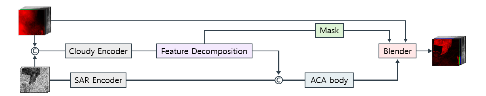

<div align="center">

# CLEAR-Net

**Cloud Layer Estimation and Adaptive Restoration Network**

*SAR-Optical Multimodal Fusion for Satellite Image Cloud Removal*

[](https://www.python.org/)
[](https://pytorch.org/)
[](https://github.com/astral-sh/uv)
[](https://huggingface.co/Hermanni/clear-net-sen12mscr)
[](LICENSE)

</div>

---

## 🛰️ Overview

**CLEAR-Net**(**C**loud **L**ayer **E**stimation and **A**daptive **R**estoration)은 SAR(Sentinel-1)과 구름 낀 광학 영상(Sentinel-2)을 함께 입력받아 구름이 제거된 광학 영상을 복원하는 멀티모달 딥러닝 모델입니다.

핵심 아이디어는 **특징 분해(Feature Decomposition)** 와 **마스크 기반 선택적 복원**입니다.

1. **Feature Extraction** — SAR과 cloudy 광학 영상 각각에서 특징을 추출합니다.
2. **Feature Decomposition** — cloudy 특징을 *clean 성분*과 *cloud-contaminated 성분*으로 분리합니다.
3. **Fusion & Restoration** — SAR 특징과 clean 성분을 융합한 뒤, ACA-CRNet 기반 디코더가 복원 후보(candidate)를 생성합니다.
4. **Spectral Mask Routing** — cloud 성분으로부터 채널별 구름 마스크를 추정하여, 구름 영역만 복원 결과로 교체합니다.

```
prediction = cloudy × (1 − mask) + candidate × mask
```

구름이 없는 영역은 원본 화소를 그대로 보존하고, 구름 영역만 복원하기 때문에 불필요한 왜곡 없이 안정적인 복원이 가능합니다.

## 🏗️ Architecture



| Component | Role |
|---|---|
| `Stem` | SAR / Cloudy 입력을 특징 공간으로 임베딩 |
| `Extractor` | 멀티스케일 인코더-디코더 기반 특징 추출 |
| `Clean / Cloudy Extractor` | cloudy 특징을 clean·cloud 성분으로 분해 |
| `ACA_CRNet` | 융합 특징으로부터 복원 후보(candidate) 생성 |
| `SpectralMaskRouter` | cloud 성분 → 채널별 구름 마스크 추정 |
| `RefineHead` (Aux) | 중간 단계 deep supervision용 보조 출력 |

**Loss** — Prediction / Candidate / Aux 세 단계에 L1 + SSIM을 적용하는 deep supervision 구조이며, route balance 정규화 항이 추가됩니다. (`modules/loss_fn/clear_net_loss.py`)

## 📊 Dataset

[SEN12MS-CR](https://patricktum.github.io/cloud_removal/)을 사용합니다. 전 지구에서 수집된 Sentinel-1 SAR / Sentinel-2 광학 영상 페어 데이터셋으로, 같은 위치의 **구름 낀 광학 영상**, **구름 없는 광학 영상(target)**, **SAR 영상**이 한 세트를 이룹니다. 사계절(spring / summer / fall / winter) 시즌별 scene으로 구성되어 있습니다.

| Input | Channels | Description |
|---|---|---|
| SAR (Sentinel-1) | 2 | VV / VH 편파 |
| Cloudy (Sentinel-2) | 13 | 멀티스펙트럴 밴드 (구름 포함) |
| Target (Sentinel-2) | 13 | 구름 없는 reference |

- 데이터 로딩과 전처리는 [cr-train](https://github.com/smturtle2/cr-train) 패키지가 담당합니다.
- Sentinel-2 반사도는 로딩 시 `/2000`으로 정규화되며, PSNR 등 지표 계산 시 원래 스케일(0~10000)로 복원해 측정합니다. (`modules/metrics/metrics.py`)

## 📁 Directory Structure

```
cr-project/
├── main.py                     # 공용 학습 러너 (main 브랜치에서만 수정)
├── tmp_main_base.py            # 개인 실험용 러너 템플릿
├── train.sh                    # GPU 선택 / tmux 지원 학습 스크립트
├── inference.sh                # 데모 서버 런처
├── .githooks/                  # main.py 보호용 pre-commit 훅
├── assets/                     # 아키텍처 다이어그램 등 문서 자산
├── modules/
│   ├── model/
│   │   ├── CLEAR_Net/          # ⭐ 주력 모델
│   │   │   ├── clear_net.py    #    CLEAR_Net 본체
│   │   │   ├── clear.py        #    Stem, Extractor, SpectralMaskRouter 등 구성 요소
│   │   │   ├── aca_crnet.py    #    복원 디코더 (ACA-CRNet)
│   │   │   └── ca_flash.py     #    FlashAttention 기반 Cross Attention
│   │   ├── baseline/           # ACA-CRNet 베이스라인
│   │   ├── fdt/, fdt_cca/      # FDT 계열 실험 모델
│   │   ├── lcr/                # LCR 실험 모델
│   │   └── module/             # 공용 attention / base 모듈
│   ├── loss_fn/                # CLEAR_NetLoss, Focal Frequency Loss 등
│   ├── metrics/                # PSNR, SSIM 등 평가 지표
│   ├── scheduler/              # LR 스케줄러 (LCR warmup-cosine)
│   └── util/                   # 시각화 유틸리티, 🎬 인터랙티브 데모 서버
└── tests/                      # 단위 테스트
```

## ⚙️ Installation

[uv](https://github.com/astral-sh/uv)를 사용합니다. 서버 환경에 맞는 torch extra를 **하나만** 골라 설치하세요.

```bash
# torch 2.6.x가 필요한 서버
uv sync --extra torch26

# CUDA 12.9용 최신 torch
uv sync --extra cu129

# 최신 stable torch
uv sync --extra latest
```

> ⚠️ extra 없이 `uv sync`만 실행하면 학습 의존성(`cr-train`, `torch`)이 설치되지 않습니다.

설치 확인:

```bash
uv run python -c "import torch; print(torch.__version__)"
```

## 🚀 Training

학습은 공용 러너(`main.py`)를 직접 수정하지 않고, 개인 러너(`tmp_main.py`)를 통해 실행합니다.

### 1. 개인 러너 만들기

```bash
cp tmp_main_base.py tmp_main.py
```

`tmp_main.py`에서 `build_model()`과 `build_optimizer()`를 구현합니다. CLEAR-Net 예시:

```python
from modules.model.CLEAR_Net import CLEAR_Net
from modules.loss_fn.clear_net_loss import make_clear_net_loss_fn

def build_model() -> nn.Module:
    return CLEAR_Net(return_decomposition=True)

def build_optimizer(model: nn.Module) -> torch.optim.Optimizer:
    return torch.optim.AdamW(model.parameters(), lr=2e-4)

def build_loss():
    # loss_fn(model_output, batch) 계약에 맞춰 주는 어댑터
    return make_clear_net_loss_fn()
```

필요하면 `build_loss()`, `build_metrics()`, `build_scheduler()` 등도 덮어쓸 수 있습니다.

### 2. 학습 실행

```bash
# 단일 GPU
./train.sh --gpu 0

# 멀티 GPU (torchrun)
./train.sh --gpus 5,6

# tmux 세션에서 백그라운드 학습
./train.sh --tmux --gpu 0

# tmp_main.py 대신 다른 러너 실행
TRAIN_TARGET=other_runner.py ./train.sh --gpu 0
```

- GPU가 여러 개인 서버에서 `./train.sh`만 실행하면 GPU 목록과 도움말이 출력됩니다.
- 기본 precision은 `bf16` AMP이며, `main(...)` 인자로 `mixed_precision="off"` / `"fp16"` 변경이 가능합니다.
- 데이터 로딩은 기본 `streaming=True`이고, 로컬 데이터셋은 `streaming=False, dataset_dir=...`로 지정합니다.

**에이전트용 학습 세션 프롬프트**

```text
In https://github.com/smturtle2/cr-project, follow the README Training workflow and prepare a user-runnable CLEAR-Net training guide: explain how to create tmp_main.py from tmp_main_base.py, use CLEAR_Net + make_clear_net_loss_fn, choose ./train.sh options, and tell the user the exact command and expected checkpoint path.
```

### 3. (한 번만) git hook 설정

`main.py` 보호용 pre-commit 훅을 활성화합니다.

```bash
git config core.hooksPath .githooks
```

## 📦 Pretrained Checkpoint

학습된 체크포인트는 [🤗 Hermanni/clear-net-sen12mscr](https://huggingface.co/Hermanni/clear-net-sen12mscr)에서 받을 수 있습니다. `CLEAR_Net(return_decomposition=True)` 기준으로 87 epoch 학습된 `best.pt`입니다.

```bash
# 기본 체크포인트 경로(artifacts/3.CLEAR-Net/v4/)로 바로 다운로드
hf download Hermanni/clear-net-sen12mscr best.pt --local-dir artifacts/3.CLEAR-Net/v4
```

**Test set 성능 (SEN12MS-CR)**

| MAE ↓ | PSNR ↑ | SSIM ↑ | SAM ↓ |
|---|---|---|---|
| 0.0274 | 28.46 | 0.8936 | 8.24 |

## 🎬 Demo


https://github.com/user-attachments/assets/428fc689-df62-44b7-9c35-e83a34459da1


https://github.com/user-attachments/assets/710a687d-b07b-4fca-be08-af5d3660f921


학습된 체크포인트로 전체 scene 단위 복원 결과를 브라우저에서 확인할 수 있는 인터랙티브 데모를 제공합니다. 가장 간단한 방법은 런처 스크립트입니다.

```bash
# 기본 체크포인트(artifacts/3.CLEAR-Net/v4/best.pt)로 실행
./inference.sh

# 체크포인트를 직접 지정
./inference.sh path/to/best.pt

# 호스트/포트/브라우저 자동 실행은 환경변수로 제어
HOST=0.0.0.0 PORT=8080 OPEN_BROWSER=1 ./inference.sh
```

> `inference.sh`는 기본적으로 브라우저를 자동으로 열지 않습니다. `OPEN_BROWSER=1`을 주거나, 실행 후 `http://127.0.0.1:8797`에 직접 접속하세요.

데모 스크립트를 직접 실행할 수도 있습니다. 이 경우 브라우저가 자동으로 열립니다.

```bash
uv run python modules/util/clear_net_scene_demo.py \
    --checkpoint artifacts/3.CLEAR-Net/v4/best.pt \
    --dataset-root /path/to/cr-train-cache \
    --split validation \
    --season spring
```

**주요 옵션**

| Option | Default | Description |
|---|---|---|
| `--checkpoint` (별칭: `--model-path`, `--model`) | `artifacts/3.CLEAR-Net/v4/best.pt` | 모델 체크포인트 경로 |
| `--dataset-root` | `/dhdd/.cache/cr-train` | 데이터셋 캐시 루트 |
| `--split` | `validation` | `train` / `validation` / `test` |
| `--season` | `spring` | `spring` / `summer` / `fall` / `winter` |
| `--scenes` | 처음 N개 scene | 콤마로 구분한 scene id 지정 |
| `--device` | `auto` | `auto` / `cpu` / `cuda` |
| `--port` | `8797` | 서버 포트 |
| `--streaming` | off | 스트리밍 데이터 로딩 사용 |

**에이전트용 추론 세션 프롬프트**

```text
In https://github.com/smturtle2/cr-project, follow the README Demo workflow and prepare a user-runnable CLEAR-Net inference guide: explain how to get Hermanni/clear-net-sen12mscr best.pt, choose ./inference.sh options, select split/season/scene, and tell the user the exact command, local URL, and dataset root.
```

## 🧪 Tests

```bash
uv run pytest tests/
```

## 🙏 Acknowledgements

- **[ACA-CRNet](https://github.com/huangwenwenlili/ACA-CRNet)** — 복원 디코더가 ACA-CRNet 구조를 기반으로 하며, PSNR 등 평가 지표 구현도 해당 저장소를 참고했습니다.
- **[SEN12MS-CR](https://patricktum.github.io/cloud_removal/)** (Ebel et al., IEEE TGRS 2021) — 학습/평가에 사용한 SAR-광학 페어 데이터셋입니다.
- **[cr-train](https://github.com/smturtle2/cr-train)** — 데이터 로딩 및 학습 파이프라인 패키지입니다.

## 📄 License

[MIT License](LICENSE)로 배포됩니다.

복원 디코더와 PSNR 지표 등 일부 코드는 [ACA-CRNet](https://github.com/huangwenwenlili/ACA-CRNet)(Apache-2.0)에서 파생되었으며, 해당 부분에는 Apache-2.0 고지가 함께 적용됩니다. 전문은 [licenses/LICENSE-ACA-CRNet](licenses/LICENSE-ACA-CRNet)을 참고하세요.
